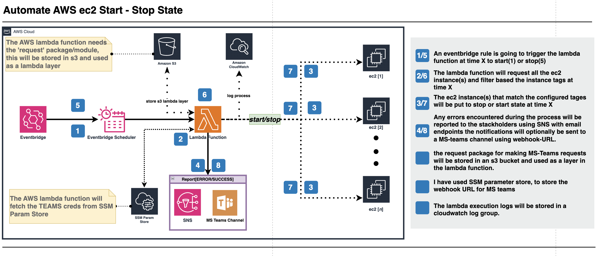

# Terraform Module: Automated EC2 Start/Stop with Notifications

This Terraform module automates the scheduled start and stop of EC2 instances using AWS EventBridge and Lambda. It also integrates notifications via Amazon SNS and optionally Microsoft Teams.

## Features

- **Automated EC2 Start/Stop**: Schedule EC2 instance start and stop based on cron or rate expressions.
- **Tag-based Instance Selection**: Target instances based on specific tags.
- **Notification System**:
  - Send email notifications via Amazon SNS for success and failure cases.
  - Optional Microsoft Teams notifications via a webhook.
- **Multi-Environment Support**: Works across `dev`, `test`, and `prod` environments.
- **Secure Webhook Storage**: Microsoft Teams webhook URLs are securely stored in AWS SSM Parameter Store.

## Architecture Overview

This solution utilizes the following AWS services:

- **AWS SNS**: Sends email notifications for success and failures.
- **AWS EventBridge Rules**:
  - **Stop Rule**: Triggers Lambda to stop EC2 instances at a scheduled time.
  - **Start Rule**: Triggers Lambda to start EC2 instances at a scheduled time.
- **AWS Lambda**: Executes EC2 start/stop operations when triggered by EventBridge.
- **AWS S3**: Stores external dependencies (e.g., `requests` module for Teams webhook calls).
- **AWS SSM Parameter Store**: Securely manages Microsoft Teams webhook URLs.[NOT ADDED]

### Infrastructure Diagram



---

## Folder Structure
```
.
├── example
│   ├── main.tf
│   ├── terraform.tf
│   ├── terraform.tfvars
│   └── variables.tf
├── infra-documentation
│   └── infra-diagram.png
├── lambda
│   └── automate-ec2-start-stop.py
├── LICENSE
├── README.md
├── data.tf
├── iam.tf
├── locals.tf
├── main.tf
├── outputs.tf
├── package-request-layer.sh
├── variables.tf
└── versions.tf
```

## Usage

```hcl
module "ec2_scheduler" {
  source = "github.com/BhekimpiloNdhlela/terraform-aws-ec2-schedule-start-stop.git"

  environment                = "prod"
  naming_prefix              = "ec2-auto-start-stop"
  region                     = "eu-west-1"
  notification_emails        = ["foo@bar.com"]
  stop_expression            = "rate(2 minutes)"
  start_expression           = "rate(1 day)"
  ms_teams_reporting_enabled = false
  ms_teams_webhook_url       = "https://foobar.webhook.office.com/..."
  error_email_subject        = "EC2 Scheduler Error Notification"
  error_email_header         = "Hi 👋🏾,\nAn error occurred while executing the EC2 scheduler Lambda:\n"
  error_email_footer         = "Please check AWS CloudWatch logs for details.\nBest,\nFooBar Team"
  success_email_subject      = "EC2 Scheduler Success Notification"
  success_email_header       = "Hi 👋🏾,\nThe EC2 scheduler Lambda executed successfully. Instances affected:\n"
  success_email_footer       = "Check AWS CloudWatch logs for execution details.\nBest,\nFooBar Team"
  schedule_auto_start_key    = "scheduled-auto-start"
  schedule_auto_start_value  = "true"
  schedule_auto_stop_key     = "scheduled-auto-stop"
  schedule_auto_stop_value   = "true"
  lambda_timeout             = 180
  lambda_memory_size         = 128     
}
```

---

## Inputs/Variables

| Name                         | Type           | Default               | Description                                        |
|------------------------------|---------------|-----------------------|----------------------------------------------------|
| `environment`                | `string`      | `""`                  | Deployment environment (`dev`, `test`, `prod`).   |
| `naming_prefix`              | `string`      | `""`                  | Prefix for AWS resource names.                    |
| `region`                     | `string`      | `""`                  | AWS region for deployment.                        |
| `notification_emails`        | `list(string)`| `[]`                  | Email recipients for notifications.               |
| `stop_expression`            | `string`      | `""`                  | Schedule for stopping EC2 instances.              |
| `start_expression`           | `string`      | `""`                  | Schedule for starting EC2 instances.              |
| `schedule_auto_start_key`    | `string`      | `"scheduled-auto-start"` | Tag key for identifying auto-start instances.   |
| `schedule_auto_start_value`  | `string`      | `"true"`              | Tag value for identifying auto-start instances.   |
| `schedule_auto_stop_key`     | `string`      | `"scheduled-auto-stop"` | Tag key for identifying auto-stop instances.   |
| `schedule_auto_stop_value`   | `string`      | `"true"`              | Tag value for identifying auto-stop instances.   |
| `ms_teams_reporting_enabled` | `bool`        | `false`                | Enable/disable Microsoft Teams reporting.        |
| `ms_teams_webhook_url`       | `string`      | `""`                  | Microsoft Teams webhook URL.                      |
| `error_email_subject`        | `string`      | `""`                  | Subject for error notification emails.           |
| `error_email_header`         | `string`      | `""`                  | Header for error notification emails.            |
| `error_email_footer`         | `string`      | `""`                  | Footer for error notification emails.            |
| `success_email_subject`      | `string`      | `""`                  | Subject for success notification emails.         |
| `success_email_header`       | `string`      | `""`                  | Header for success notification emails.          |
| `success_email_footer`       | `string`      | `""`                  | Footer for success notification emails.          |
| `lambda_timeout`             | `number`      | `30`                   | Timeout for the Lambda function in seconds.      |
| `lambda_memory_size`         | `number`      | `128`                  | Memory size for the Lambda function in MB.       |

## Outputs

| Name              | Description                                |
| ----------------- | ------------------------------------------ |
| `sns_topic_arn`   | ARN of the SNS topic for notifications.    |
| `lambda_function` | Name of the Lambda function.               |
| `cloudwatch_logs` | CloudWatch Log Group for Lambda logging.   |

---

## Requirements

- Terraform 1.0+
- AWS Provider 4.0+
- IAM permissions for EC2, Lambda, SNS, and CloudWatch.
- AWS Account & Access Keys: Ensure you have an active AWS account with programmatic access configured via access keys.


---

## Deployment Steps

1. Clone the repository:

   ```bash
   git clone https://github.com/BhekimpiloNdhlela/terraform-aws-ec2-schedule-start-stop.git
   cd terraform-aws-ec2-schedule-start-stop
   ```

Packaging the Request Layer,  Before running Terraform, you need to package the `requests` library as a Lambda layer. Use the following steps:

2. Run the provided script to package the `requests` library:
   ```bash
   sh package-request-layer.sh
   ```

3. Ensure that `requests.zip` is created successfully in the `layer/` directory.
   ```
   ls layer/
   ```


4. Initialize Terraform:

   ```bash
   terraform init
   ```

5. Plan and apply:

   ```bash
   terraform plan
   terraform apply
   ```

---


## License

This project is licensed under the MIT License. See the [LICENSE](LICENSE) file for details.


## Author
Maintained by **Bheki Ndhlela**. Contributions are welcome!

