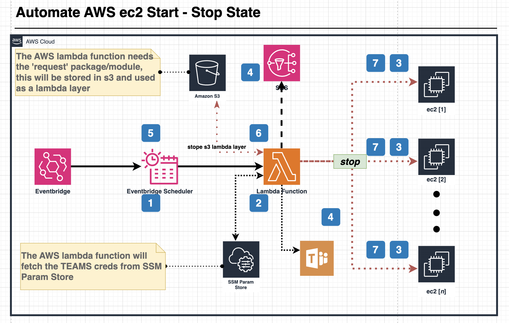

# Terraform Module: Automate EC2 Start/Stop with Notifications

This Terraform module automates the start and stop of specified EC2 instances on a defined schedule using AWS EventBridge and Lambda. Notifications are sent via Amazon SNS and optionally reported to Microsoft Teams.

## Features

- Automatically start and stop EC2 instances based on cron or rate expressions.
- Filter EC2 instances using tags to identify which instances should be started or stopped.
- Send email notifications via SNS in case of errors or successful executions.
- Optional reporting to Microsoft Teams via a webhook.
- Configurable for different environments (e.g., `dev`, `test`, `prod`).

---

## Architecture/Infrastructure
This solution leverages the following AWS services:

- **AWS SNS**  
  Simple Notification Service (SNS) is used to send emails to the specified email endpoints. SNS is responsible for reporting errors or notifying the success/failure of the start/stop process.

- **AWS EventBridge Rule (STOP)**  
  This rule is configured to trigger the Lambda function to stop EC2 instances that match the specified tags.

- **AWS EventBridge Rule (START)**  
  This rule is configured to trigger the Lambda function to start EC2 instances that match the specified tags.

- **AWS Lambda**  
  The Lambda function is used to start or stop EC2 instances when triggered by an EventBridge rule, based on the defined schedule.

- **AWS S3**  
  An S3 bucket is used to store an external module (`requests`), which is required for making POST requests to the Microsoft Teams Incoming Webhook endpoint.

- **AWS SSM Parameter Store**  
  The Microsoft Teams Incoming Webhook URL is securely stored in AWS Systems Manager (SSM) Parameter Store.

The following is the infrastructure diagram of the solution:



---

## Usage

```hcl
module "automate_ec2_start_stop" {
  source = "github.com/BhekimpiloNdhlela/terraform-aws-ec2-schedule-start-stop.git"

  environment                = "prod"
  naming_prefix              = "ec2-auto-start-stop"
  region                     = "eu-west-1"
  notification_emails        = ["bheki@cloudandthings.io"]
  stop_expression            = "rate(2 minutes)"
  start_expression           = "rate(1 day)"
  ms_teams_reporting_enabled = true
  ms_teams_webhook_url       = "https://cloudandthingsza.webhook.office.com/..."
  error_email_subject        = "Lambda Error Notification [EC2 Start/Stop]"
  error_email_header         = "Hi 👋🏾,\nThe following error occurred while running the Lambda function:\n"
  error_email_footer         = "Please check the AWS CloudWatch logs for more details.\nBest regards,\nFooBar Team"
  success_email_subject      = "Lambda Success Notification [EC2 Start/Stop]"
  success_email_header       = "Hi 👋🏾,\nThe Lambda function executed successfully, the following EC2 instance(s) were terminated:\n"
  success_email_footer       = "Please review the AWS CloudWatch logs for detailed execution information.\nBest regards,\nFooBar Team"
  schedule_auto_start_key    = "scheduled-auto-start"
  schedule_auto_start_value  = "true"
  schedule_auto_stop_key     = "scheduled-auto-stop"
  schedule_auto_stop_value   = "true"
}
```

---

## Inputs

| Name                         | Type           | Default | Description                                                   |
| ---------------------------- | -------------- | ------- | ------------------------------------------------------------- |
| `environment`                | `string`       | `""`    | The environment for deployment (e.g., `dev`, `test`, `prod`). |
| `naming_prefix`              | `string`       | `""`    | Prefix for naming AWS resources.                              |
| `region`                     | `string`       | `""`    | AWS region for resource deployment.                           |
| `notification_emails`        | `list(string)` | `[]`    | List of email addresses to receive notifications.             |
| `stop_expression`            | `string`       | `""`    | Rate or cron expression for stopping EC2 instances.           |
| `start_expression`           | `string`       | `""`    | Rate or cron expression for starting EC2 instances.           |
| `ms_teams_reporting_enabled` | `bool`         | `true`  | Enable or disable MS Teams reporting.                         |
| `ms_teams_webhook_url`       | `string`       | `""`    | Microsoft Teams webhook URL for reporting.                    |
| `error_email_subject`        | `string`       | `""`    | Subject for error notification emails.                        |
| `error_email_header`         | `string`       | `""`    | Header for error notification emails.                         |
| `error_email_footer`         | `string`       | `""`    | Footer for error notification emails.                         |
| `success_email_subject`      | `string`       | `""`    | Subject for success notification emails.                      |
| `success_email_header`       | `string`       | `""`    | Header for success notification emails.                       |
| `success_email_footer`       | `string`       | `""`    | Footer for success notification emails.                       |
| `schedule_auto_start_key`    | `string`       | `""`    | The tag key used to identify instances to auto-start.         |
| `schedule_auto_start_value`  | `string`       | `""`    | The tag value used to identify instances to auto-start.       |
| `schedule_auto_stop_key`     | `string`       | `""`    | The tag key used to identify instances to auto-stop.          |
| `schedule_auto_stop_value`   | `string`       | `""`    | The tag value used to identify instances to auto-stop.        |

---

## Outputs

| Name              | Description                              |
| ----------------- | ---------------------------------------- |
| `sns_topic_arn`   | ARN of the SNS topic for notifications.  |
| `lambda_function` | Name of the Lambda function.             |
| `cloudwatch_logs` | CloudWatch Log Group used by the Lambda. |

---

## Requirements

- Terraform 1.0+
- AWS Provider 4.0+
- IAM permissions to create Lambda, EC2, SNS, and CloudWatch resources.

---

## Deployment

1. Clone the repository:

   ```bash
   git clone https://github.com/BhekimpiloNdhlela/terraform-aws-ec2-schedule-start-stop.git
   cd automate-ec2-start-stop
   ```

2. Create a `terraform.tfvars` file with your configuration:

   ```hcl
   environment                = "prod"
   naming_prefix              = "ec2-auto-start-stop"
   region                     = "eu-west-1"
   notification_emails        = ["bheki@cloudandthings.io"]
   stop_expression            = "rate(2 minutes)"
   start_expression           = "rate(1 day)"
   ms_teams_reporting_enabled = true
   ms_teams_webhook_url       = "https://cloudandthingsza.webhook.office.com/..."
   ```

3. Initialize Terraform:

   ```bash
   terraform init
   ```

4. Plan and apply:
   ```bash
   terraform plan
   terraform apply
   ```

---

## Author

This module is maintained by **Bheki Ndhlela**. Contributions are welcome!

## License

This project is licensed under the MIT License. See the [LICENSE](LICENSE) file for details.

